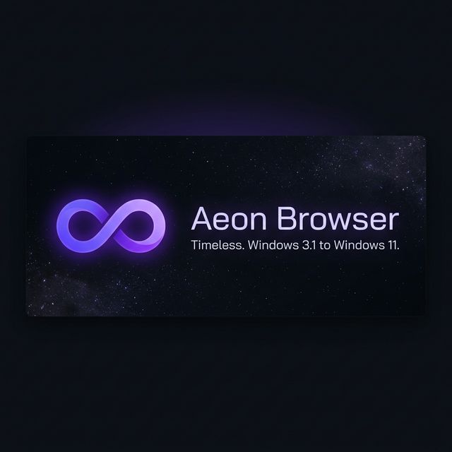
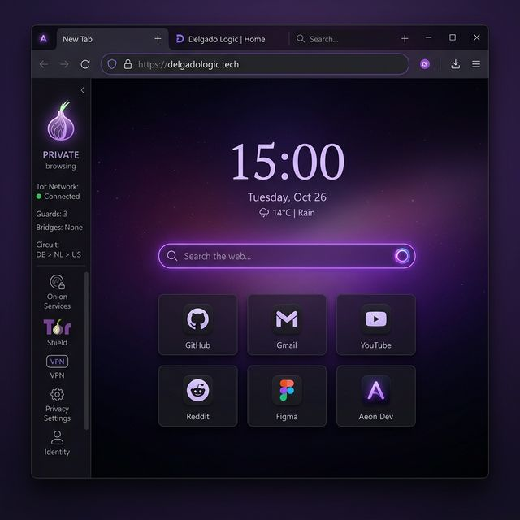
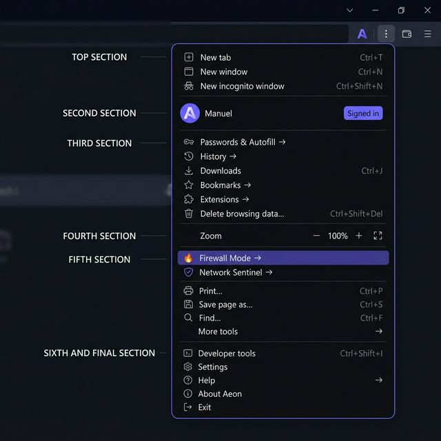
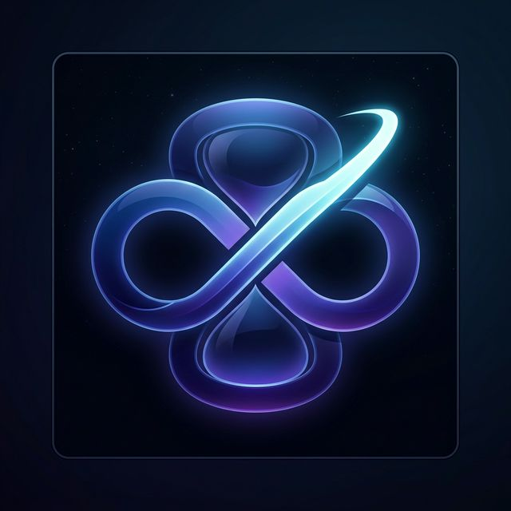
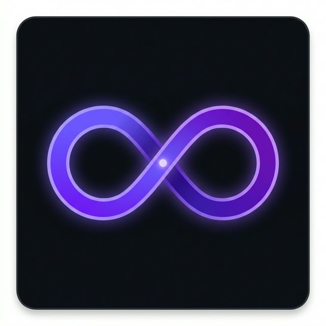

<div align="center">



<br><br>


# Aeon Browser

**The browser that works everywhere. Windows 3.1 to Windows 11.**

*Zero inherited vulnerabilities. Our DNA. Our code. Our rules.*

<br>

[](https://github.com/DelgadoLogic/AeonBrowser)
[](LICENSE)
[](https://delgadologic.tech)
[](https://delgadologic.tech/aeon)
[](https://delgadologic.tech/logicflow)

</div>

---

## ✨ What is Aeon?

Aeon is a **from-scratch web browser** built by [DelgadoLogic](https://delgadologic.tech).

We studied the best browsers ever made — **Chromium, Firefox, Arc, Brave, Vivaldi, Waterfox, Mypal, Supermium** — and rewrote everything from the ground up. No forks. No inherited CVEs. No compromises.

It ships bundled inside the **[LogicFlow](https://delgadologic.tech/logicflow)** installer, runs on everything from a 1994 Pentium 66 running Windows 3.11 to a modern gaming rig on Windows 11, and brings full TLS 1.3, Tor, I2P, and ad-blocking to every machine.

---

## 🖥️ UI Preview



*Aeon Browser — dark mode new tab page with aurora background, live clock, and speed dial*

---

## 🖱️ App Menu (Three-Dot Menu)



*Aeon's Chrome-style app menu — includes 🔥 Firewall Mode and 🛡 Network Sentinel quick-access*

---

## 🏆 Why Aeon vs the Competition

| Feature | Aeon | Chrome | Firefox | Brave | Edge |
|---------|------|--------|---------|-------|------|
| Works on Windows 3.1 | ✅ | ❌ | ❌ | ❌ | ❌ |
| Works on Windows XP | ✅ | ❌ | ❌ | ❌ | ❌ |
| Works on Windows Vista/7 | ✅ | ❌ | ⚠️ | ❌ | ❌ |
| Zero upstream CVEs | ✅ | ❌ | ❌ | ❌ | ❌ |
| Built-in Tor | ✅ | ❌ | ❌ | ❌ | ❌ |
| Built-in I2P | ✅ | ❌ | ❌ | ❌ | ❌ |
| Native ad-blocker (no extension) | ✅ | ❌ | ❌ | ✅ | ❌ |
| FTP + Magnet + Torrent download | ✅ | ❌ | ❌ | ❌ | ❌ |
| Gemini/Gopher support | ✅ | ❌ | ❌ | ❌ | ❌ |
| Tab sleep (< 5MB idle) | ✅ | ⚠️ | ⚠️ | ⚠️ | ✅ |
| Password vault (DPAPI) | ✅ | ✅ | ✅ | ✅ | ✅ |
| Ships with system optimizer | ✅ | ❌ | ❌ | ❌ | ❌ |

---

## 🎯 Target Platform Matrix

| Tier | OS | Renderer | TLS | RAM Idle |
|------|----|----------|-----|---------|
| **Pro** | Windows 10 / 11 | Blink shim | Native TLS 1.3 | ~150 MB |
| **Modern** | Windows 8 / 8.1 | Blink shim | Native TLS 1.3 | ~120 MB |
| **Extended** | Windows Vista / 7 | Gecko (light) | Schannel unlock | ~80 MB |
| **XP-Hi** | Windows XP + SSE2 | Blink (XP build) | WolfSSL | ~60 MB |
| **XP-Lo** | Windows XP (no SSE2) | Gecko (no SSE2) | WolfSSL | ~45 MB |
| **2000** | Windows 2000 | HTML4 renderer | WolfSSL | ~30 MB |
| **9x** | Windows 95/98/ME | HTML4 renderer | WolfSSL 32-bit | ~20 MB |
| **Win16** | Windows 3.1 / 3.11 | HTML4 GDI 16-bit | WolfSSL 16-bit | ~6 MB |

> **How does it know which tier to use?**  
> `HardwareProbe.cpp` runs at startup and detects your OS, CPU, and RAM.  
> The `TierDispatcher` loads the right engine DLL automatically. Zero config needed.

---

## 🌐 Protocol Support

Aeon is the **only browser** that supports all of these natively:

```
https://  http://  tor://  .onion    ← Clear web + Tor dark web
gemini:// gopher://                  ← Alternative internet protocols  
ftp://    ftps://                    ← File transfer (download only)
magnet:   torrent:                   ← BitTorrent downloads (NO seeding)
ipfs://   ipns://                    ← Decentralized web
i2p://    .i2p                       ← I2P anonymous network
file://                              ← Local file viewer
aeon://                              ← Internal pages (newtab, settings, etc.)
```

---

## 🔒 Security Architecture

```
┌─────────────────────────────────────────────────────────┐
│                   AEON SECURITY MODEL                   │
├─────────────┬───────────────────────────────────────────┤
│ TLS         │ WolfSSL (legacy) or OS-native Schannel    │
│ DNS         │ DNS-over-HTTPS — Cloudflare 1.1.1.1       │
│ Tracking    │ EasyList engine — native C++, not JS ext  │
│ Fingerprint │ Canvas + WebGL + Audio randomization       │
│ Privacy     │ GPC header injected on every request       │
│ Passwords   │ Windows DPAPI (CryptProtectData)           │
│ Tor         │ Embedded Arti (Rust) — no Tor Browser dep │
│ I2P         │ i2pd child process — transit tunnels OFF   │
│ Updates     │ WinTrust Authenticode + SHA-256 verify     │
│ Sandbox     │ Renderer process isolation per tab         │
└─────────────┴───────────────────────────────────────────┘
```

**Zero inherited CVEs.** Aeon is not a Chromium fork or Firefox fork.  
We studied them and wrote our own from scratch.

---

## 🏗️ Architecture Overview

```
AeonBrowser/
├── core/                    ← C++ Browser Host Process
│   ├── probe/               HardwareProbe  — OS + CPU + Tier detection
│   ├── engine/              TierDispatcher + AeonEngine DLL interface (C ABI)
│   ├── ui/                  EraChrome      — Mica (Win11) / Win32 (Legacy) UI
│   ├── tls/                 TlsAbstraction — WolfSSL / Schannel / TLS 1.3
│   ├── protocol/            NewTabHandler  — aeon:// internal pages
│   ├── settings/            SettingsEngine — JSON + HKLM two-tier config
│   ├── session/             SessionManager — crash recovery + tab restore
│   ├── crash/               CrashHandler   — minidump + telemetry queue
│   └── memory/              TabSleepManager— 30-min idle = 5 MB suspended tab
│
├── router/                  ← Rust Protocol Router (aeon_router.dll)
│   └── src/
│       ├── router.rs        14-protocol scheme dispatcher
│       ├── downloader.rs    Download manager (NO seeding, compile-time)
│       ├── tor.rs           Arti Tor client (embedded, no Tor Browser)
│       └── gemini.rs        Gemini + Gopher handlers
│
├── engines/                 ← Renderer DLLs (swappable per tier)
│   └── blink/               aeon_blink_stub.cpp → aeon_blink.dll
│
├── history/                 ← SQLite3 Bookmark + History Engine
│   └── HistoryEngine.cpp    WAL mode, incognito = :memory:, Netscape export
│
├── privacy/                 ← Content Blocker
│   └── ContentBlocker.cpp   EasyList, DoH, GPC, fingerprint guard
│
├── updater/                 ← Auto-Updater
│   └── AutoUpdater.cpp      WinTrust Authenticode + SHA-256 + 3 channels
│
├── telemetry/               ← Anonymous Telemetry
│   └── PulseBridge.cpp      Category-level only, opt-out, shared with LogicFlow
│
├── resources/
│   └── newtab/newtab.html   ← aeon://newtab — aurora + clock + speed dial
│
└── retro/                   ← 16-bit Windows 3.x Tier
    ├── aeon16.c             WinMain — full 16-bit browser entry point
    ├── html4.c              HTML4/CSS2 GDI renderer (word-wrap, headings, links)
    └── wolfssl_bridge.c     WinSock 1.1 + WolfSSL TLS 1.3 (16-bit)
```

---

## 🖼️ Icon Pack

| Small | Medium | Large |
|-------|--------|-------|
|  |  |  |
| 16 / 32px | 48 / 64px | 128 / 256px |

*All sizes baked into a single `Aeon.ico` using `resources/icons/build_icon.ps1`*

---

## 🚀 Building

### Requirements
- **MSVC 2022** (x64 for Pro/Modern, x86 for XP tiers)
- **Rust 1.75+** (`cargo` for router DLL)
- **CMake 3.22+**
- **Open Watcom 2.0** (16-bit Win3.x retro tier only)

### Quick Build (Pro tier — Windows 10/11)
```bash
# Clone
git clone https://github.com/DelgadoLogic/AeonBrowser.git
cd AeonBrowser

# Build Rust router
cd router && cargo build --release && cd ..

# Configure + build C++ core
cmake -B build -DAEON_TARGET_TIER=Pro -DCMAKE_BUILD_TYPE=Release
cmake --build build --config Release

# Build icons
powershell -File resources/icons/build_icon.ps1
```

### All Tiers
```bash
cmake -B build -DAEON_TARGET_TIER=Extended   # Vista/7
cmake -B build -DAEON_TARGET_TIER=XPHi       # XP + SSE2
cmake -B build -DAEON_TARGET_TIER=Retro      # Win9x/2000

# 16-bit (Win3.x) — requires Open Watcom 2.0
cd retro && wmake
```

---

## 🔧 Telemetry & Privacy

| Data collected | ✅/❌ |
|---|---|
| OS tier (e.g., "WinXP-HiSpec") | ✅ Anonymous |
| RAM bucket (<512MB / 512MB-2GB / 2GB+) | ✅ Anonymous |
| Crash reports (path only, no content) | ✅ Anonymous |
| Browser locale | ✅ Anonymous |
| URLs visited | ❌ Never |
| Search queries | ❌ Never |
| Form data / passwords | ❌ Never |
| IP address | ❌ Never |
| Device identifiers | ❌ Never |

**Opt out:** `HKLM\SOFTWARE\DelgadoLogic\Aeon\TelemetryEnabled = 0`  
*(Same registry key as LogicFlow — one opt-out covers everything by DelgadoLogic)*

---

## 📦 Releases

Aeon Browser ships inside the **[LogicFlow installer](https://delgadologic.tech/logicflow)**.  
It can also be installed as a standalone browser.

| Channel | Cadence | Audience |
|---------|---------|---------|
| **Stable** | Monthly | Everyone |
| **Beta** | Bi-weekly | Power users |
| **Nightly** | Daily | Developers |

Updates are delivered via `update.delgadologic.tech` — verified with **Authenticode** signature + **SHA-256** hash before installation.

---

## 📄 License

**Proprietary — © 2026 DelgadoLogic. All rights reserved.**

Reference codebases were studied for architectural patterns only. No code was copied.  
Third-party component licenses:

| Component | License | Integration |
|-----------|---------|-------------|
| WolfSSL | GPLv2 + commercial | Separate DLL |
| Arti (Tor) | MIT/Apache 2.0 | Rust crate |
| i2pd | BSD 3-clause | Child process |
| SQLite3 | Public domain | Vendored amalgamation |

---

---


**Aeon Browser by DelgadoLogic**

*Timeless. From Windows 3.1 to Windows 11.*

[🌐 delgadologic.tech](https://delgadologic.tech) · [📦 LogicFlow](https://delgadologic.tech/logicflow) · [🐛 Issues](https://github.com/DelgadoLogic/AeonBrowser/issues) · [📧 Support](https://delgadologic.tech/support)
