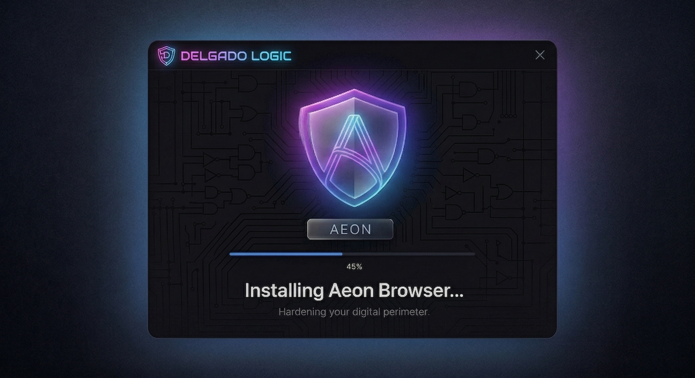

<div align="center">


<br/>


# Aeon Browser

**The sovereign browser. No telemetry. No upstream CVEs. No exceptions.**

*Built from scratch by [DelgadoLogic](https://github.com/DelgadoLogic) · Windows 3.1 → Windows 11 → Every Platform*

<br/>

[](https://github.com/DelgadoLogic/aeon-engine/releases)
[](https://github.com/DelgadoLogic/aeon-engine)
[](https://github.com/DelgadoLogic/aeon-engine)
[](LICENSE)
[](docs/AI_DESIGN.md)

</div>

---

## What Is Aeon?

Aeon is a **ground-up browser** — not a Chromium skin, not a Firefox fork. Every component is written from first principles with one objective: **you own your browsing, completely**.

No Google DNS resolvers phoning home. No Safe Browsing cloud calls. No sync servers we don't control. No inherited vulnerability debt from upstream. And uniquely: **it runs on everything** — from a 1994 Windows 3.1 machine to your latest Windows 11 PC.

---

## Screenshots

<div align="center">


*New Tab Page · Deep space dark mode · Glassmorphism speed dial · Private search*

<br/><br/>


*App Menu · Firewall Mode · Network Sentinel · Zero-telemetry by default*

<br/><br/>



*Installer · Ed25519-signed sovereign manifest · "Hardening your digital perimeter"*

</div>

---

## Core Philosophy — AeonDNA

| Principle | What It Means |
|-----------|--------------|
| 🛡 **Sovereignty** | No Google, Microsoft, or third-party cloud calls by default. Ever. |
| 🌍 **Universality** | 8 hardware tiers covering every Windows version ever shipped |
| 🤖 **Autonomy** | 6-agent Evolution Engine patches CVEs while you sleep |
| 🔐 **Privacy by Architecture** | Zero-knowledge sync · Local AI only · P2P collective intelligence |
| 🔗 **Zero CVE Inheritance** | Built from scratch — no upstream vulnerability debt |

---

## Key Features

### 🌐 Runs On Everything — 8-Tier Engine System

Aeon auto-detects your hardware at launch and loads the right engine automatically.

| Tier | Platform | Renderer | TLS |
|------|----------|----------|-----|
| **Pro** | Windows 10 / 11 | Stripped Blink (no Google DNA) | TLS 1.3 native |
| **Modern** | Windows 8 / 8.1 | Stripped Blink | TLS 1.3 native |
| **Extended** | Windows Vista / 7 | Gecko (light build) | Schannel unlocked |
| **XP-Hi** | Windows XP (SSE2) | Blink XP build | WolfSSL |
| **XP-Lo** | Windows XP (no SSE2) | Gecko no-SSE2 | WolfSSL |
| **Win2000** | Windows 2000 | HTML4 GDI engine | WolfSSL |
| **Win9x** | Windows 95 / 98 / ME | HTML4 GDI 32-bit | WolfSSL 32-bit |
| **Win16** | Windows 3.1 / 3.11 | HTML4 GDI 16-bit | WolfSSL 16-bit |

---

### 🔒 Privacy Stack

```
All traffic → Rust Protocol Router (aeon_router.dll)
├── 14 schemes: https, tor://, i2p://, gemini://, ipfs://, magnet:, aeon://...
├── DNS: DoH cascade — Cloudflare ECH → Quad9 → NextDNS (no system DNS)
└── CircumventionEngine:
    ├── GoodbyeDPI  — SNI fragmentation, evades deep packet inspection
    ├── zapret      — TCP window manipulation
    ├── ECH         — hides destination domain from ISP/DPI
    └── Tor meek    — last resort bridge if all else is blocked
```

- **Network Sentinel** — real-time per-domain firewall rule enforcement
- **Firewall Mode** — whitelist-only; nothing gets through unless you explicitly allow it
- **Built-in Ad Blocker** — updated via sovereign P2P, no cloud dependency
- **Fingerprint Protection** — Canvas, WebGL, Audio randomized every session

---

### 🤖 Autonomous Evolution Engine — The Browser That Patches Itself

While you browse, six AI agents run silently in the background:

| Agent | Role |
|-------|------|
| **Research Agent** | Monitors NVD, GitHub Advisories, arXiv, CISA KEV 24/7 for new CVEs |
| **Patch Writer** | CodeLlama generates C++ fixes for vulnerabilities targeting our codebase |
| **Vote Coordinator** | 66% of AeonHive peers must approve a patch before it applies |
| **Build Worker** | Donates idle CPU to the P2P Ninja build mesh — gets faster with more users |
| **Self Trainer** | Weekly LoRA fine-tune on GCP — AI improves its own patch quality every Sunday |
| **Silence Policy** | Pauses ALL background tasks when CPU > 15% or you're actively using your machine |

**The self-improvement loop:** More users → better peer voting → better training data → smarter patches → more secure browser → more users. It compounds automatically.

---

### 🧠 AI That Browses For You — Agent Mode

Aeon doesn't just have an AI sidebar — it can **do things on the web for you**.

```
You:  "Find me the cheapest flight from Miami to NYC next Friday"
Aeon: → Opens comparison tabs silently in background
      → Reads pages directly (native Blink DOM — no screenshot hacks)
      → Compares results, extracts data
      → "Frontier $89 · Spirit $92 · JetBlue $156 — want me to book Frontier?"
```

Unlike other AI browsers that use slow, unreliable computer-vision hacks, Aeon reads the DOM directly through a native Blink bridge — the same way DevTools does it. **100× more reliable. No cloud. No vision API costs.**

**Privacy contract:** Agent Mode never reports your browsing. The model runs locally (phi-3-mini 4-bit). Nothing leaves your machine.

---

### 🧩 AeonHive — The P2P Network That Gets Faster With Users

Every Aeon installation is a node. The more people use Aeon, the more powerful it gets for everyone:

```
100 users    → anchor nodes carry all load            → builds ~normal speed
1,000 users  → 100 donate idle CPU                    → builds 3× faster
10,000 users → 500 donate idle CPU                    → builds 15× faster
100,000 users→ network self-sustaining                → infrastructure cost → $0
```

Contributing CPU earns **Aeon Credits** — redeemable for Pro subscription time, priority updates, and future compute tokens.

---

### 🔄 Sovereign Updates — Ed25519 Signed, Always Verified

No update is ever blindly trusted. Every release is:

1. **Built** in our isolated GCP Cloud Build environment
2. **Signed** with our Ed25519 master key (stored in GCP Secret Manager — never on disk)
3. **Distributed** P2P via AeonHive (BitTorrent-style — cheap, fast, resilient)
4. **Verified** by your installed Aeon — SHA-256 + Ed25519 before anything runs

SHA-256 mismatch or invalid signature? Update is silently rejected. No user prompt. No risk.

---

## Platform Roadmap

```
✅ Phase 1 — Windows (2026)         All 8 tiers: Win3.1 → Win11
🟡 Phase 2 — Linux   (Q3 2026)      x86_64 + ARM64 · AppImage · .deb · .rpm
🟡 Phase 3 — Android (Q1 2027)      Privacy Shell (fast) → Sovereign Engine
🔴 Phase 4 — macOS   (Q2 2027)      Cocoa UI · AppStore + direct dist
🔴 Phase 5 — iOS     (Q4 2027)      WebKit renderer + full Aeon network layer
🔴 Phase 6 — AeonHive Sovereign     Fully self-sustaining P2P infrastructure
```

**Android strategy:** Phase 3A ships a Privacy Shell fast (Aeon UI + network layer over Android WebView). Phase 3B replaces it with our own stripped-Blink engine. We're also targeting Android 4.x — a massive underserved market in emerging economies that nobody else supports.

---

## Project Structure

```
aeon-engine/
├── aeon/
│   ├── config/                   # GN build config — all Google APIs zeroed
│   │   ├── args.gn               # Sovereign build flags
│   │   └── AeonFeatures.h/.cc    # Feature adopt/strip + Finch override
│   ├── shield/
│   │   └── AeonShield.cc         # NetworkDelegate — blocks GCP endpoints
│   ├── workspace/
│   │   └── AeonWorkspace.h       # Split-screen tab engine
│   ├── agent/
│   │   └── AeonWebMCP.h          # WebMCP local-only bridge (AeonAgent)
│   └── evolution/                # Autonomous Evolution Engine (Python/FastAPI)
│       ├── aeon_research_agent.py
│       ├── aeon_patch_writer.py
│       ├── aeon_vote_coordinator.py
│       ├── aeon_build_worker.py
│       ├── aeon_self_cloud_trainer.py
│       └── aeon_silence_policy.py
├── router/                       # Rust protocol router (aeon_router.dll)
├── updater/
│   └── AutoUpdater.cpp           # P2P chunk distribution + Ed25519 verify
├── assets/
│   └── aeon_icon.png             # Master brand icon
├── installer/                    # NSIS/Inno Setup sovereign installer
│   └── assets/
│       └── installer_reference.jpg
├── resources/
│   └── images/                   # Documentation images
├── docs/
│   └── UI_DESIGN_SPEC.md         # Canonical glassmorphism UI standard (internal)
└── .github/workflows/            # CI/CD — GCP Cloud Build → Cloud Run deploy
```

---

## Building Aeon

> Full builds require the `aeon-build-env` Docker image from our Artifact Registry.  
> The evolution engine and router can be built independently.

### Evolution Engine (open build)
```bash
cd aeon/evolution
pip install -r requirements.txt
uvicorn aeon_vote_coordinator:app --host 0.0.0.0 --port 8080
```

### Rust Router (open build)
```bash
cd router
cargo build --release
# Output: router/target/release/aeon_router.dll (Windows)
#         router/target/release/libAeonRouter.so (Linux)
```

### Full Browser Engine (requires build env)
```bash
docker pull us-east1-docker.pkg.dev/aeon-browser-build/aeon-build-env/builder:latest
docker run --rm -v $(pwd):/work aeon-builder ninja -C out/Release
```

---

## Security

**Found a vulnerability?** Do not open a public issue.

📧 `security@delgadologic.com`  
🔑 PGP key: `delgadologic.com/pgp`

We triage all reports within **48 hours**. Critical CVEs are patched via the Evolution Engine — the fix is peer-voted, signed, and distributed within 24 hours of confirmation.

---

## License

Aeon Browser is **proprietary software** owned by DelgadoLogic.  
Source is provided for audit transparency and community contribution only.  
Redistribution, resale, or derivative commercial products are prohibited without explicit written permission.

See [LICENSE](LICENSE) for full terms.

---

<div align="center">

**Built with sovereignty in mind.**

*© 2026 DelgadoLogic · Manuel A. Delgado · All Rights Reserved*

[DelgadoLogic GitHub](https://github.com/DelgadoLogic) · [Report a Bug](https://github.com/DelgadoLogic/aeon-engine/issues) · [Security Policy](SECURITY.md)

</div>
